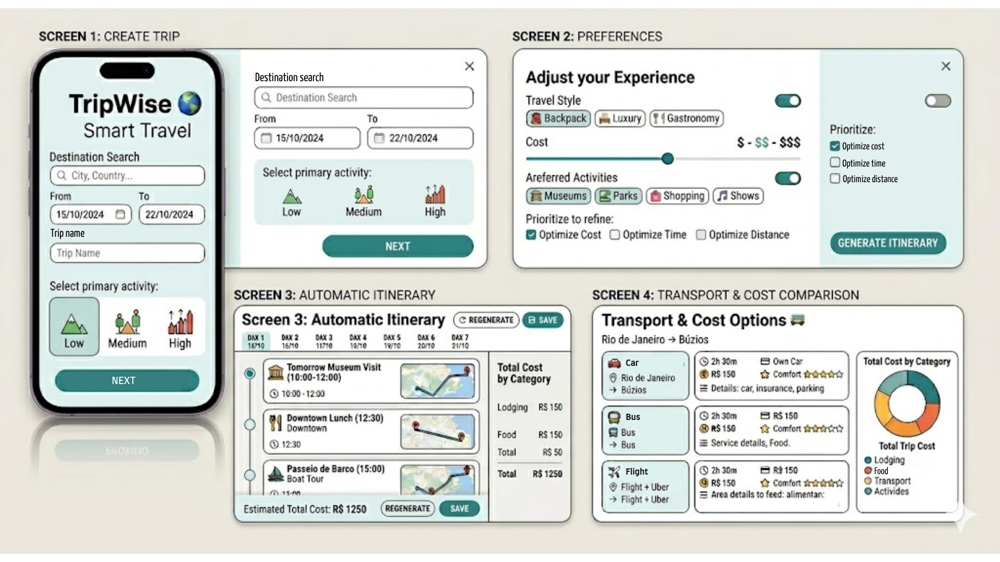

# 🌍 TripWise – Smart Travel Planning System


---

## 🇧🇷 Sobre o Projeto

O **TripWise** é um sistema inteligente de planejamento de viagens desenvolvido no contexto da disciplina de Engenharia de Software da Fatec São Carlos.

O sistema tem como objetivo auxiliar usuários na criação de roteiros personalizados, considerando preferências individuais, custos estimados, opções de transporte e otimização de rotas.

A proposta busca centralizar informações normalmente dispersas em diferentes plataformas, oferecendo uma experiência integrada de planejamento de viagens.



---

## 🇺🇸 About the Project

TripWise is a smart travel planning system developed as part of a Software Engineering academic project.

The system aims to assist users in creating personalized travel itineraries based on preferences, estimated costs, transportation options and route optimization.

---

## 🎯 Objetivos do Projeto

### Objetivo Geral

Desenvolver um sistema capaz de gerar roteiros personalizados com sugestões de atividades, estimativas de custos e otimização de deslocamento.

### Objetivos Específicos

- Centralizar informações de planejamento de viagens
- Auxiliar na tomada de decisão dos usuários
- Automatizar a geração de roteiros
- Fornecer estimativas de custos
- Comparar alternativas de transporte
- Otimizar trajetos entre destinos

---

## 🚀 Funcionalidades

### Requisitos Funcionais

- Cadastro de viagens com múltiplos destinos
- Configuração de preferências do usuário
- Geração automática de roteiros
- Estimativa de custos
- Comparação de meios de transporte
- Otimização de rotas

### Requisitos Não Funcionais

- Interface responsiva
- Segurança dos dados do usuário
- Integração com PostgreSQL
- Desempenho adequado na geração de roteiros

---

## 📄 Documentação

- 📌 Requisitos do Sistema
- 👤 Histórias de Usuário
- 📋 Product Backlog
- 🎯 User Story Cards
- 📊 Planejamento Ágil
- 📈 Story Points

---

## 🎨 Diagramas UML

### Diagrama de Casos de Uso


### Diagrama de Sequência


### Diagrama de Estados


---

## 🛠 Tecnologias Utilizadas

| Categoria | Tecnologia |
|------------|------------|
| Frontend | React.js |
| Backend | Node.js |
| Banco de Dados | PostgreSQL |
| Versionamento | Git |
| Repositório | GitHub |
| Gestão Ágil | GitHub Projects |

---

## 🧩 Metodologia

O desenvolvimento do projeto foi baseado em conceitos de Engenharia de Software e metodologias ágeis.

### Técnicas Utilizadas

- Levantamento de Requisitos
- Modelagem UML
- User Stories
- GitHub Issues
- GitHub Projects
- Kanban
- Planning Poker
- Story Points

---

## 📋 Gestão Ágil do Projeto

O gerenciamento das atividades foi realizado por meio do GitHub Projects utilizando um fluxo Kanban.

### Estrutura do Backlog

| Tipo | Quantidade |
|--------|----------:|
| Requisitos Funcionais | 6 |
| Requisitos Não Funcionais | 4 |
| Total de User Stories | 10 |

### Estimativas Planning Poker

| Story Points | Complexidade |
|-------------|--------------|
| 3 | Baixa |
| 5 | Moderada |
| 8 | Média |
| 13 | Alta |

### Esforço Total do Projeto

**76 Story Points**

### Quadro Kanban

Projeto disponível em:

https://github.com/users/pauloferreira2004-design/projects/2/views/1

---

## 📂 Estrutura do Projeto

```text
TripWise/
│
├── docs/
│   ├── requisitos.md
│   ├── historias-de-usuario.md
│   ├── diagramas/
│   │   ├── diagrama-casos-de-uso.png
│   │   ├── diagrama-sequencia.png
│   │   └── diagrama-estados.png
│
├── README.md
```

---

## 📈 Status do Projeto

🚧 Em desenvolvimento

Projeto acadêmico de Engenharia de Software com gerenciamento ágil utilizando GitHub Projects, Kanban e Planning Poker.

---

## 👨‍💻 Autor

**Paulo Alberto Garcia Ferreira**

Acadêmico de Gestão de Big Data na Fatec São Carlos

Projeto desenvolvido sob orientação do Prof. Me. Arnaldo Napolitano Sanchez.

---

## 📄 Licença

Este projeto possui finalidade exclusivamente acadêmica e educacional.

Não possui fins comerciais.
