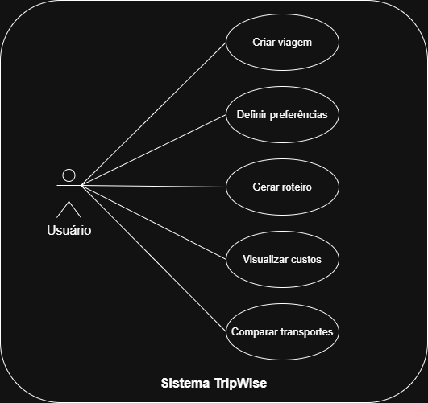
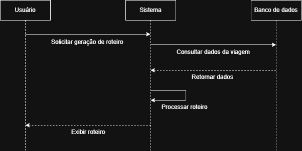
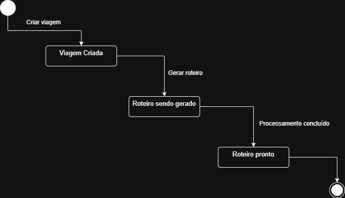

# 🌍 TripWise – Smart Travel Planning System


---

## 🇧🇷 Sobre o Projeto

O **TripWise** é um sistema de planejamento inteligente de viagens que auxilia usuários na criação de roteiros otimizados, considerando tempo, custo e preferências pessoais.

Atualmente, o planejamento de viagens exige o uso de múltiplas plataformas, tornando o processo complexo e ineficiente. O TripWise centraliza essas funcionalidades em um único sistema, facilitando a tomada de decisão.

---

## 🇺🇸 About the Project

**TripWise** is a smart travel planning system that helps users create optimized travel itineraries based on time, cost, and personal preferences.

It simplifies trip planning by integrating multiple functionalities into a single platform.

---

## 🎯 Objetivo / Objective

### 🇧🇷

Desenvolver um sistema capaz de gerar roteiros personalizados com sugestões de atividades, estimativas de custo e otimização de deslocamento.

### 🇺🇸

To develop a system capable of generating personalized itineraries with activity suggestions, cost estimation, and route optimization.

---

## 🚀 Funcionalidades / Features

### 🇧🇷

* Cadastro de viagens com múltiplos destinos
* Definição de preferências do usuário
* Geração automática de roteiros
* Estimativa de custos
* Comparação de transportes
* Otimização de rotas

### 🇺🇸

* Multi-destination trip creation
* User preference settings
* Automatic itinerary generation
* Cost estimation
* Transport comparison
* Route optimization

---

## 📄 Documentação

* 📌 [Requisitos do Sistema](docs/requisitos.md)
* 👤 [Histórias de Usuário](docs/historias-de-usuario.md)

---

## 🎨 Diagramas

### 🔹 Diagrama de Casos de Uso



---

### 🔹 Diagrama de Sequência



---

### 🔹 Diagrama de Estados



---

## 🛠 Tecnologias Utilizadas / Technologies

* Frontend: React.js
* Backend: Node.js
* Banco de Dados: PostgreSQL
* Versionamento: Git e GitHub

---
## 🧩 Metodologia / Methodology

### 🇧🇷 Metodologia

O desenvolvimento do TripWise foi baseado em conceitos de Engenharia de Software e práticas ágeis, com foco na organização, clareza e rastreabilidade dos requisitos.

Foram utilizadas as seguintes abordagens:

- **Levantamento de Requisitos**: definição de requisitos funcionais e não funcionais do sistema  
- **Modelagem UML**: criação de diagramas de casos de uso, sequência e estados  
- **Histórias de Usuário**: descrição das funcionalidades sob a perspectiva do usuário  
- **Cards de História**: detalhamento das histórias com critérios de aceitação  
- **Documentação Estruturada**: organização do projeto no GitHub com separação por arquivos e diretórios  

Essa abordagem permite melhor compreensão do sistema, facilitando sua evolução e manutenção.

---

### 🇺🇸 Methodology

The development of TripWise was based on Software Engineering principles and agile practices, focusing on organization, clarity, and requirement traceability.

The following approaches were used:

- **Requirements Elicitation**: definition of functional and non-functional requirements  
- **UML Modeling**: creation of use case, sequence, and state diagrams  
- **User Stories**: description of system features from the user's perspective  
- **User Story Cards**: detailed stories including acceptance criteria  
- **Structured Documentation**: project organization in GitHub using a clear folder structure  

This approach improves system understanding and facilitates future evolution and maintenance.

---
## 📂 Estrutura do Projeto / Project Structure

```
TripWise/
│
├── docs/
│   ├── requisitos.md
│   ├── historias-de-usuario.md
│   ├── diagramas/
│       ├── diagrama-casos-de-uso.png
│       ├── diagrama-sequencia.png
│       ├── diagrama-estados.png
│
├── README.md
```

---

## 📌 Status do Projeto / Project Status

### 🇧🇷

🚧 Em desenvolvimento (Projeto acadêmico – Engenharia de Software)

### 🇺🇸

🚧 In development (Academic project – Software Engineering)

---

## 👨‍💻 Autor / Author

**Paulo Alberto Garcia Ferreira**

---

## 📄 Licença / License

Este projeto é de caráter acadêmico e sem fins comerciais.
This project is academic and non-commercial.
